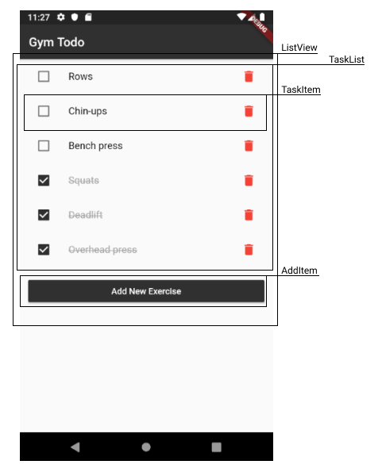

# Gym Todo

A todo app to help keep track of exercises to be done at the gym every week.

## Why?

To build a todo app that can I can use at the gym. Each todo item will uncheck itself a week after it's been checked. This helps to keep track of all the exercises to be completed in a week, while being flexible about which day they get done.

Also to learn Dart and Flutter by building a practical application and to learn and contribute with other members of the Google Developer Group Toronto Study Jam.

## Technologies Used

- Flutter
- Provider
- SQLite

## Running locally

- Make sure Flutter is [installed](https://flutter.dev/docs/get-started/install)
- Clone this repo
- Run your simulator
- `cd` into the directory
- Run `flutter pub get` and `flutter run`

## Progress

- [x] Basic CRUD: add, delete, check/uncheck todos
- [x] Persist todo list on device
- [x] Store date/time of completed tasks
- [x] Uncheck todo after a week of being completed

## Architecture

Here's a tree of the widgets used:

Here's how that maps to the UI:

